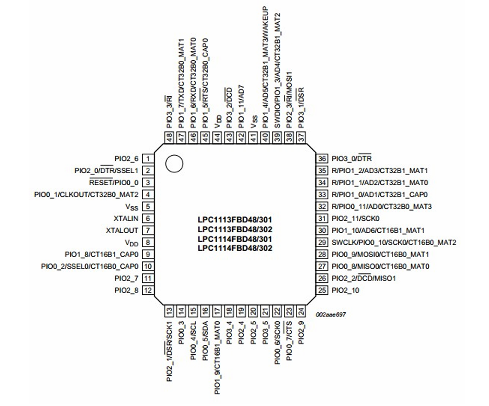
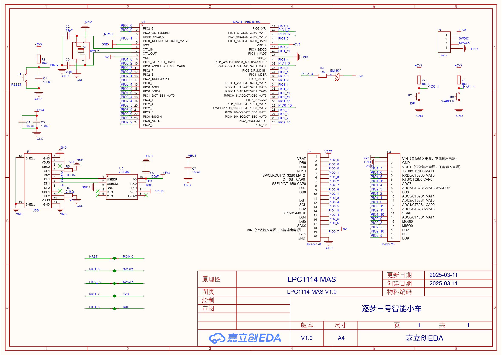

# LPC1114 BSP 说明

## 简介

本文档为 NXP LPC1114 ARM Cortex-M0 微控制器的 BSP (板级支持包) 说明。

主要内容如下：

- 开发板资源介绍
- BSP 快速上手
- 进阶使用方法

通过阅读快速上手章节开发者可以快速地上手该 BSP，将 RT-Thread 运行在开发板上。在进阶使用指南章节，将会介绍更多高级功能，帮助开发者利用 RT-Thread 驱动更多板载资源。

### 开发环境与工具链

| 组件                 | 版本/说明                                                  |
| -------------------- | ---------------------------------------------------------- |
| **IDE**              | JetBrains CLion（支持 CMake 项目管理）                     |
| **编译器**           | `arm-none-eabi-gcc`（GNU Arm Embedded Toolchain）          |
| **主机环境**         | Windows 11（通过 MinGW 兼容层运行构建脚本）                |
| **调试/烧录工具**    | OpenOCD（版本：20250710-0.12.0，适配 LPC1114 的 SWD 接口） |
| **包管理与环境配置** | RT-Thread Env 工具（Windows 版本：env-windows-v2.0.0）     |

> **注**：项目采用 CMake 构建系统，确保跨平台兼容性；通过 `.gdbinit` 与 OpenOCD 集成，支持 CLion 内一键调试。
>
> 目前 scons 支持生成 cmake 配置文件，可以使用 CLion 进行 C板 的程序开发，推荐同学们尝试。详细步骤可参见：[在 Clion 中调试 rt-thread 工程](https://club.rt-thread.org/ask/article/2840.html)

## 使用说明

使用说明分为如下两个章节：

- 快速上手

  本章节是为刚接触 RT-Thread 的新手准备的使用说明，遵循简单的步骤即可将 RT-Thread 操作系统运行在该开发板上，看到实验效果 。

- 进阶使用

  本章节是为需要在 RT-Thread 操作系统上使用更多开发板资源的开发者准备的。通过使用[ENV 工具](https://docs.rt-thread.org/#/development-tools/env/env)对 BSP 进行配置，可以开启更多板载资源，实现更多高级功能。

### 快速上手

本 BSP 为开发者提供 MDK5 和 IAR 工程，并且支持 GCC 开发环境。下面以 GCC 开发环境为例，介绍如何将系统运行起来。

#### 硬件连接

将准备好的 ST-Link/JLink/DapLink 与开发板连接。

#### 编译下载

打开 Clion工程，编译并下载程序到开发板。

> 工程默认配置使用 DapLink  下载程序，点击下载按钮即可下载程序到开发板。

#### 运行结果

下载程序成功之后，系统会自动运行，观察开发板上 LED 的运行效果，LED 会以蓝光进行周期性闪烁。

### 进阶使用

此 BSP 默认只开启了 GPIO3_3的功能，更多高级功能需要利用 ENV 工具对 BSP 进行配置，步骤如下：

1. 在 BSP 下打开 env 工具。

2. 输入 `menuconfig` 命令配置工程，配置好之后保存退出。

3. 输入 `pkgs --update` 命令更新软件包。

4. 输入 `scons --target=cmake/mdk4/mdk5/iar` 命令重新生成工程。

本章节更多详细的介绍请参考 [STM32 系列 BSP 外设驱动使用教程](../docs/STM32 系列 BSP 外设驱动使用教程. md)。

## 注意事项

- 目前 scons 支持生成 cmake 配置文件，可以使用 CLion 进行 C板 的程序开发，推荐同学们尝试。详细步骤可参见：[在 Clion 中调试 rt-thread 工程](https://club.rt-thread.org/ask/article/2840.html)

## LPC1114引脚功能图、开发板原理图

## 声明

**本项目仅供学习交流使用。**

**本项目主要来自于 RT-Thread 官方开源 BSP（Board Support Package）库，并针对 NXP LPC1114 微控制器 进行了适配与优化。**

如需了解 RT-Thread 相关信息，请访问：[rt-thread.org](https://www.rt-thread.org/)
如需 NXP LPC1114 技术文档，请访问：[LPC1114FBD48 产品信息 | NXP Semiconductors](https://www.nxp.com.cn/part/LPC1114FBD48)

